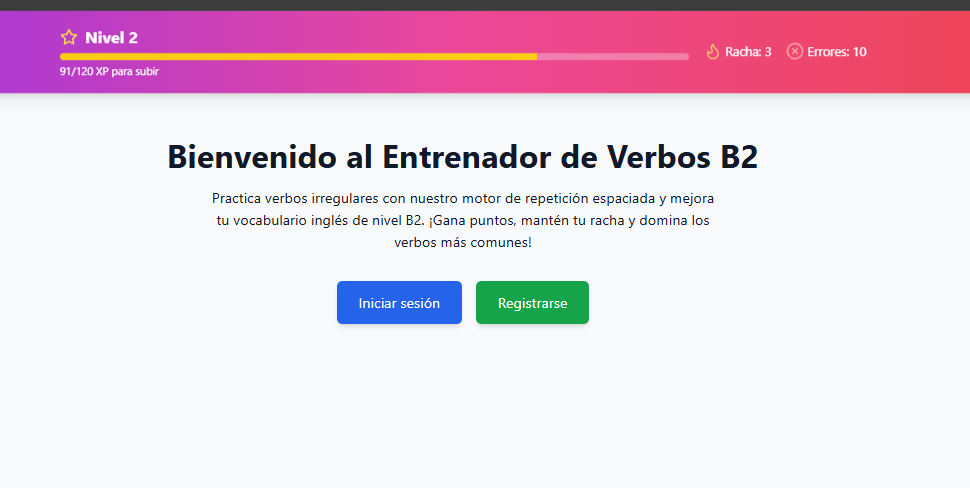
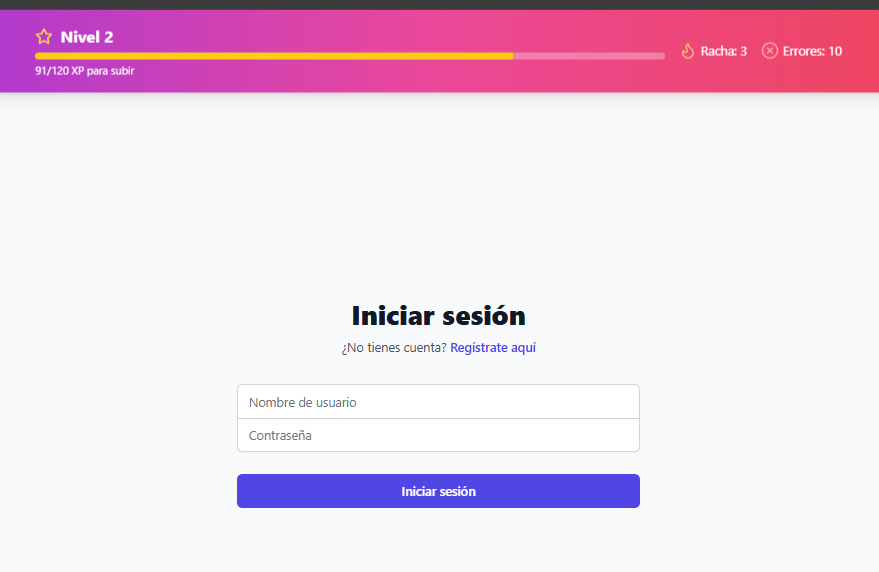
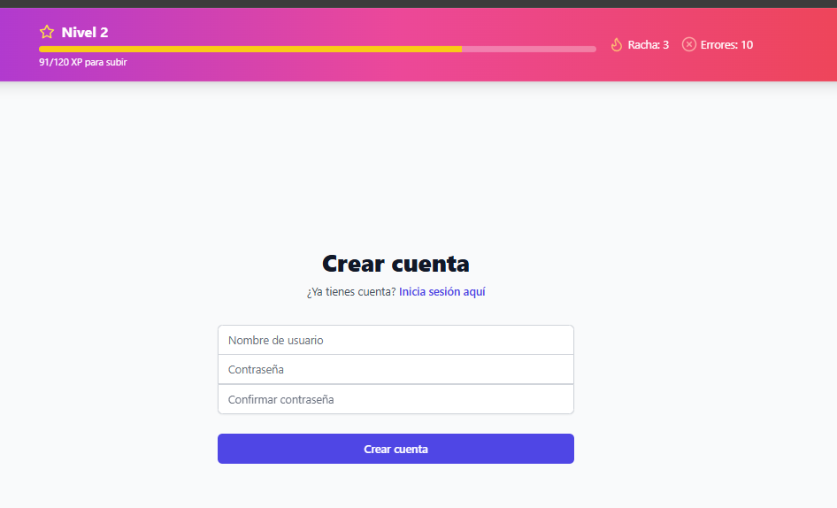
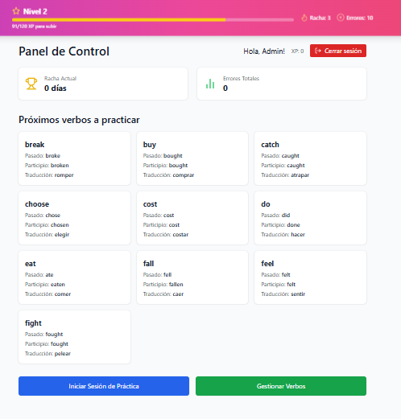
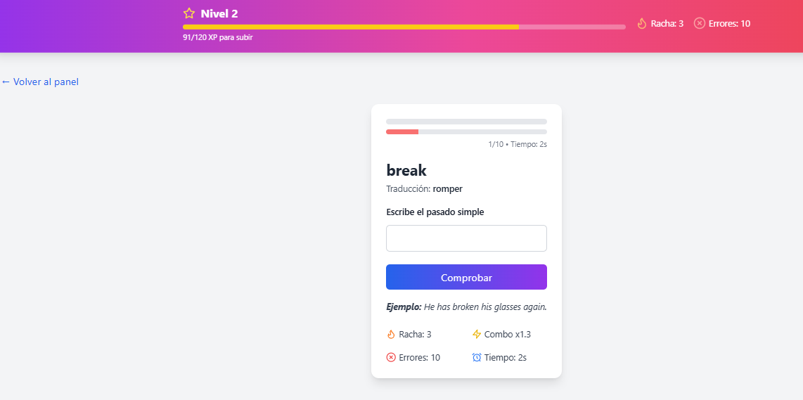
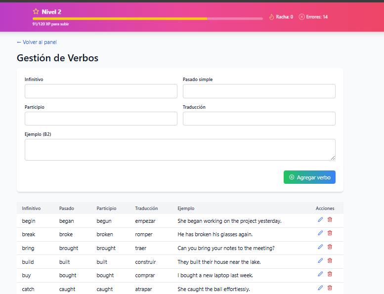

# B2 English App

¡Bienvenido 👋!  
**B2 English App** es una plataforma/aplicación diseñada para ayudar a practicar y mejorar el inglés a nivel intermedio-alto (B2), combinando ejercicios, contenido interactivo y buenas prácticas de aprendizaje.

---

## 📌 Descripción

Esta aplicación sirve para que estudiantes de inglés fortalezcan sus competencias lingüísticas (vocabulario, gramática, comprensión, expresión) con funcionalidades como:

- ✅ Lecciones temáticas y prácticas
- ✅ Ejercicios de vocabulario y gramática
- ✅ Tests y evaluaciones
- ✅ Interfaz web y backend conectados

👉 Proyecto desarrollado como parte de un portafolio de aprendizaje y uso de tecnologías modernas para aplicaciones full‑stack.

---

## 🚀 Tecnologías usadas

El proyecto combina varias tecnologías modernas:

- **Frontend:** TypeScript + (React u otro framework similar, según el código)
- **Backend:** Python (Django / Flask / FastAPI) o Node.js/Express (según el código del backend)
- **Contenedores:** Docker y `docker-compose`
- **Entorno de desarrollo:** archivo `.env` para variables de configuración  

> Revisa las carpetas `backend` y `frontend` para más detalles sobre el stack exacto.  
> (Aquí puedes ajustar los nombres de frameworks concretos que estés usando.)

---

## 🧩 Estructura del proyecto

```text
b2englishapp/
├── backend/                 # Código del servidor y API
├── frontend/                # Código del cliente web
├── backups/                 # Scripts o datos de backup
├── .env.example             # Variables de entorno de ejemplo
├── docker-compose.yml       # Orquestación de contenedores
└── README.md                # Documentación (tú estás aquí)
```

---

## 🖼️ Capturas de pantalla

> Nota: estas rutas asumen que guardas las imágenes en `screenshots/` en la raíz del proyecto.
> Cambia las rutas si usas otra carpeta (`docs/img`, `assets`, etc.).

### Pantalla de bienvenida



---

### Inicio de sesión



---

### Crear cuenta



---

### Panel de control de práctica



---

### Ejercicio de verbo irregular



---

### Gestión de verbos (admin)



---

## 🛠️ Cómo instalar & ejecutar

Sigue estos pasos para levantar la aplicación localmente.

### 1. Clona el repositorio

```sh
git clone https://github.com/Diego-debian/b2englishapp.git
cd b2englishapp
```

### 2. Crea tu archivo de entorno

```sh
cp .env.example .env
```

Rellena las variables de entorno según tus credenciales y configuración (puertos, URLs, claves, etc.).

### 3. Ejecuta con Docker

```sh
docker compose up --build
```

### 4. Accede en tu navegador

- Frontend: `http://localhost:3000`
- Backend: `http://localhost:8000`

> Los puertos pueden variar según tu configuración de `.env` y `docker-compose.yml`.

---

## 🧪 Ejecución sin Docker (opcional)

Si prefieres no usar Docker, puedes levantar frontend y backend por separado.

### Backend

```sh
cd backend
# Crear entorno virtual (opcional pero recomendado)
python -m venv venv
source venv/bin/activate  # En Windows: venv\Scripts ctivate

# Instalar dependencias
pip install -r requirements.txt

# Ejecutar servidor (ajusta según tu framework)
python main.py
# o, por ejemplo:
# python manage.py runserver
```

### Frontend

```sh
cd frontend

# Instalar dependencias
npm install   # o pnpm/yarn, según uses

# Ejecutar en modo desarrollo
npm run dev   # o npm start, según tu configuración
```

---

## 💡 Cómo usar la aplicación

Una vez levantada:

1. Regístrate o inicia sesión.
2. Explora módulos temáticos de verbos irregulares B2.
3. Resuelve ejercicios y revisa tus resultados.
4. Repite lecciones para mejorar tu nivel y subir de nivel de XP.

---

## 🤝 Contribuir

¡Las colaboraciones son bienvenidas! ⭐

Si quieres contribuir:

1. Haz un **fork** del proyecto.
2. Crea una rama para tu funcionalidad:
   ```sh
   git checkout -b feature/nueva-funcionalidad
   ```
3. Realiza tus cambios y commitea:
   ```sh
   git commit -m "Añade nueva funcionalidad"
   ```
4. Envía un **pull request** describiendo tus cambios.

---

## 🧾 Licencia

Este proyecto está bajo la licencia **GPL3**.  
Consulta el archivo `LICENSE` para más detalles.

---

## 📫 Contacto

Si quieres contactarme:

- GitHub: https://github.com/Diego-debian
- Email: profediegoparra01@gmail.com  # opcional, cámbialo o elimínalo
