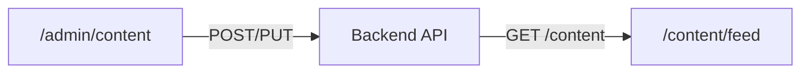

# Phase 12 — Admin to Feed Data Flow Diagnosis

> **Ticket**: T12.4  
> **Role**: Arquitecto QA / Diagnóstico técnico  
> **Date**: 2026-01-19  
> **Status**: Analysis Only (NO CODE CHANGES)

---

## 1. Expected Data Flow



**Expectation**: Content created in Admin should appear in public Feed after publishing.

---

## 2. Observed Architecture

### Admin Panel Data Source

| Component | File | Data Source |
|-----------|------|-------------|
| Content List | `/app/admin/content/page.tsx` | `useContentStore` |
| Create | `/app/admin/content/new/page.tsx` | `useContentStore.addItem()` |
| Edit | `/app/admin/content/[slug]/edit/page.tsx` | `useContentStore.updateItem()` |
| Publish | `ContentList.tsx` | `useContentStore.setStatus()` |

**Store Definition**: `frontend/store/contentStore.ts`
```typescript
// Line 78-79
export const useContentStore = create<ContentState>()(
    persist(
        (set, get) => ({ ... }),
        { name: "b2english-content" }  // localStorage key
    )
);
```

**Evidence**:
- Uses Zustand with `persist` middleware
- Data stored in **localStorage** under key `"b2english-content"`
- Initial seed from `@/data/content.json`
- **NO backend API calls for CRUD operations**

---

### Public Feed Data Source

| Component | File | Data Source |
|-----------|------|-------------|
| Feed Page (Server) | `/app/content/feed/page.tsx` | `fetchContentList()` |
| Detail Page (Server) | `/app/content/[slug]/page.tsx` | `fetchContentBySlug()` |

**Client Definition**: `frontend/lib/contentClient.ts`
```typescript
// Line 56-60
export async function fetchContentList(): Promise<ContentItemV1[]> {
    if (!isContentBackendReadV1Enabled()) {
        console.log("[ContentClient] Backend Read Disabled -> Using Mock");
        return MOCK_CONTENT.filter(isPublished);
    }
    // ... try backend fetch, fallback to MOCK_CONTENT on error
}
```

**Evidence**:
- Feed uses `contentClient.ts` adapter
- When `CONTENT_BACKEND_READ_V1=false`: reads from `MOCK_CONTENT` (hardcoded array in `lib/mockContent.ts`)
- When `CONTENT_BACKEND_READ_V1=true`: fetches from `${NEXT_PUBLIC_API_URL}/content`
- **NEVER reads from localStorage/Zustand store**

---

## 3. Feature Flags Active

| Flag | Effect on Feed |
|------|---------------|
| `NEXT_PUBLIC_FEATURE_CONTENT=true` | Enables content routes |
| `NEXT_PUBLIC_FEATURE_CONTENT_BACKEND_READ_V1=false` | Feed reads from `MOCK_CONTENT` |
| `NEXT_PUBLIC_FEATURE_CONTENT_BACKEND_READ_V1=true` | Feed reads from Backend API |

---

## 4. Point of Rupture

### Root Cause

```
┌─────────────────────────────────────────────────────────────────┐
│                                                                 │
│   ADMIN (localStorage)  ←──✖ NO CONNECTION ✖──→  FEED (Mock/API)│
│                                                                 │
└─────────────────────────────────────────────────────────────────┘
```

**Diagnosis**: The Admin panel and Public Feed use **completely isolated data sources**.

| Operation | Admin Storage | Feed Source | Connected? |
|-----------|---------------|-------------|------------|
| Create content | localStorage (Zustand) | MOCK_CONTENT or Backend API | ❌ NO |
| Edit content | localStorage (Zustand) | MOCK_CONTENT or Backend API | ❌ NO |
| Publish content | localStorage (Zustand) | MOCK_CONTENT or Backend API | ❌ NO |

---

## 5. Evidence Summary

### Admin Writes To:
```
Browser localStorage["b2english-content"]
```

### Feed Reads From (Flag OFF):
```
lib/mockContent.ts → MOCK_CONTENT array (hardcoded)
```

### Feed Reads From (Flag ON):
```
Backend API: GET ${NEXT_PUBLIC_API_URL}/content
```

### Missing Link:
- Admin does NOT write to Backend API
- Admin does NOT update Backend database
- Feed does NOT read from localStorage

---

## 6. Technical Conclusion

> **The Admin panel operates in a demo-only mode with localStorage persistence. Content created or published in Admin is stored exclusively in the browser and is never synchronized with the Backend API that the Feed consumes.**

This is **by design** as documented in `contentStore.ts`:
```typescript
// Lines 1-8
/**
 * Content store for Admin Content UI.
 * Isolated from core stores (authStore, practiceStore).
 * Persists to localStorage for demo purposes.
 * 
 * LIMITATION: Data is stored in browser localStorage only.
 * Changes are lost when localStorage is cleared.
 * For production, migrate to backend API.
 */
```

---

## 7. Proposed Future Task (Not Implemented)

### Option A: Admin → Backend Sync
- Add backend write operations to Admin (POST/PUT/DELETE to `/content`)
- Enable `CONTENT_BACKEND_READ_V1=true` for Feed
- Requires: API endpoints, authentication, error handling

### Option B: Unified Mock Source
- Make Admin read/write from same `MOCK_CONTENT` or shared JSON
- Quick demo fix but not production-ready

### Option C: Document as Expected Behavior
- Clearly label Admin as "Demo Mode"
- Add visual indicator in Admin UI

---

## 8. Artifacts Consulted (No Modifications)

- `frontend/store/contentStore.ts` — Zustand store definition
- `frontend/lib/contentClient.ts` — Feed data adapter
- `frontend/lib/mockContent.ts` — Static mock data
- `frontend/app/content/feed/page.tsx` — Feed server component
- `frontend/app/admin/content/*.tsx` — Admin pages

---

## Confirmation

✅ **NO CODE WAS TOUCHED** — Analysis and documentation only
